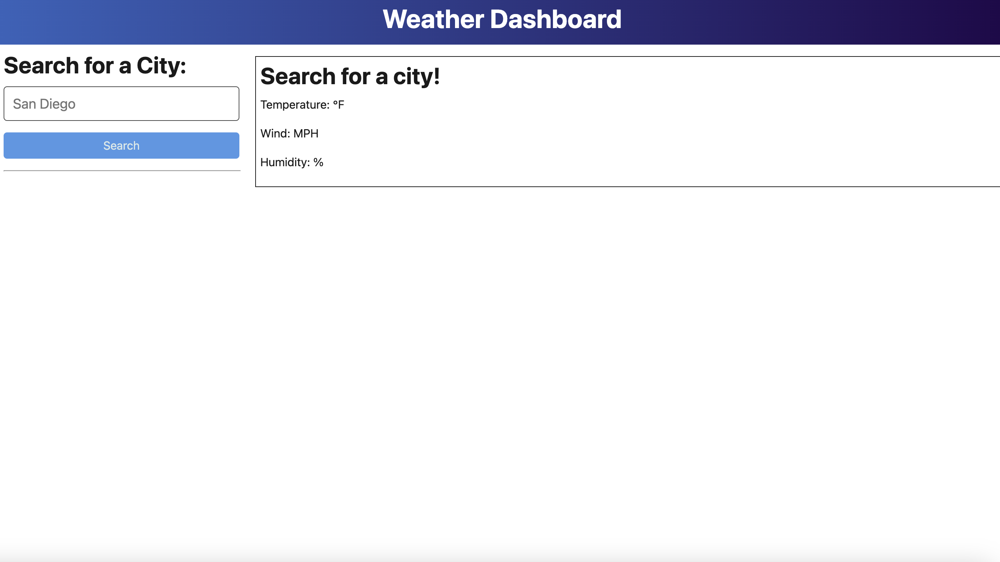
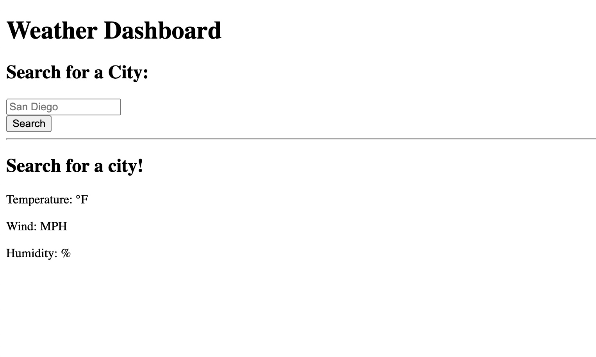

# API Weather Tracker

This weather tracker is a tool that allows users to see the current weather status of any city in the world via the OpenWeather API.

## Installation

This is a front-end app accessible in the browser via URL.

## Usage

Ordinarily, this tool would allow users to see the current weather status of any city in the world via the OpenWeather API.

## Contributors

This app was worked on by Morgan Troper, though sadly was never completed. Additional code sourced from Chat GPT.

## License 

[MIT](https://choosealicense.com/licenses/mit/)

///
